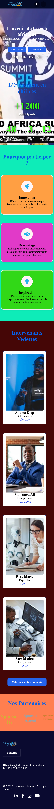
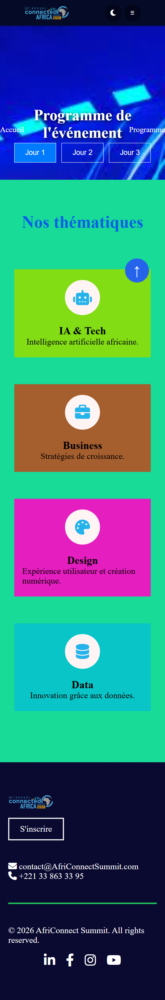
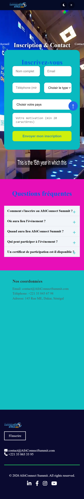

# AfriConnectSummit 2026

Projet examen — Plateforme AfriConnect Summit

## Auteur : ANRAFA SAID

Classe : Licence 1 Data Science & Big Data (ISI)

## Description

AfriConnect Summit est un site web vitrine moderne, responsive et interactif conçu pour une conférence tech panafricaine fictive. Le projet présente l'événement, les intervenants, le programme détaillé sur trois jours ainsi qu'un espace d'inscription et de contact complet.

## Technologies utilisées

* HTML5 (Structure sémantique et accessibilité)
* CSS3 (Flexbox, CSS Grid, variables CSS, responsive design)
* JavaScript Vanilla (Manipulation du DOM, interactivité, stockage local)
* Git & GitHub (Version control et déploiement)

## Fonctionnalités JavaScript implémentées

1. Dark / Light Mode : Bascule de thème persistante avec sauvegarde dans le localStorage.
2. Navbar dynamique : Effet de défilement et menu hamburger mobile interactif.
3. Animations au scroll : Apparition progressive des sections via IntersectionObserver et compteurs animés.
4. Onglets du programme : Affichage dynamique du planning pour les 3 jours de la conférence.
5. Filtrage des intervenants : Tri dynamique par thématique sans rechargement de page.
6. Validation de formulaire : Contrôle complet des champs (regex email, longueur du téléphone et du message).
7. Bouton retour en haut : Navigation fluide (scrollTo avec behavior: smooth).
8. Année dynamique : Mise à jour automatique de l'année dans le pied de page.

## Ressources consultées
* MDN Web Docs & W3Schools
* CSS-Tricks (Flexbox & Grid)
* Google Fonts & Font Awesome (Icônes)
* Unsplash / Pexels (Images libres de droits)

## Structure du projet

ANRAFA-SAID-AfriConnectSummit/
├── css/
│   └── style.css
├── images/
│   ├── video/
│   ├── (photo libres depuis...)
│   ├── expert1.jpg
│   ├── expert2.jpg
│   ├── expert3.jpg
│   ├── expert4.jpg
│   ├── expert5.jpg
│   ├── expert6.jpg
│   ├── expert7.jpg
│   ├── expert8.jpg
│   ├── expert9.jpg
│   ├── images (2).jpg
│   ├── images.jpg
│   ├── photo1.jpg
│   ├── photo2.jpg
│   ├── photo3.jpg
│   └── photo4.jpg
├── js/
│   └── main.js
├── contact.html
├── index.html
├── intervenants.html
├── programme.html
└── README.md

Installation

1. Cloner le dépôt :

git clone https://github.com/anrafasaid35-said/ANRAFA-SAID-AfriConnect-Summit.git

2. Ouvrir le dossier du projet.
3. Lancer le fichier index.html dans un navigateur.

Site en ligne

## Lien GitHub Pages :

  https://anrafasaid35-said.github.io/ANRAFA-SAID-AfriConnect-Summit/

   
## Capture d'écran

  * Page d'accueil : 
  * Page Programme : 
  * Page Intervenants : 
  * Page Contact : 

## Auteur
   ANRAFA SAID

Projet réalisé dans le cadre du module de Développement Web.

Licence 1

Projet académique à but pédagogique de fin du semestre.